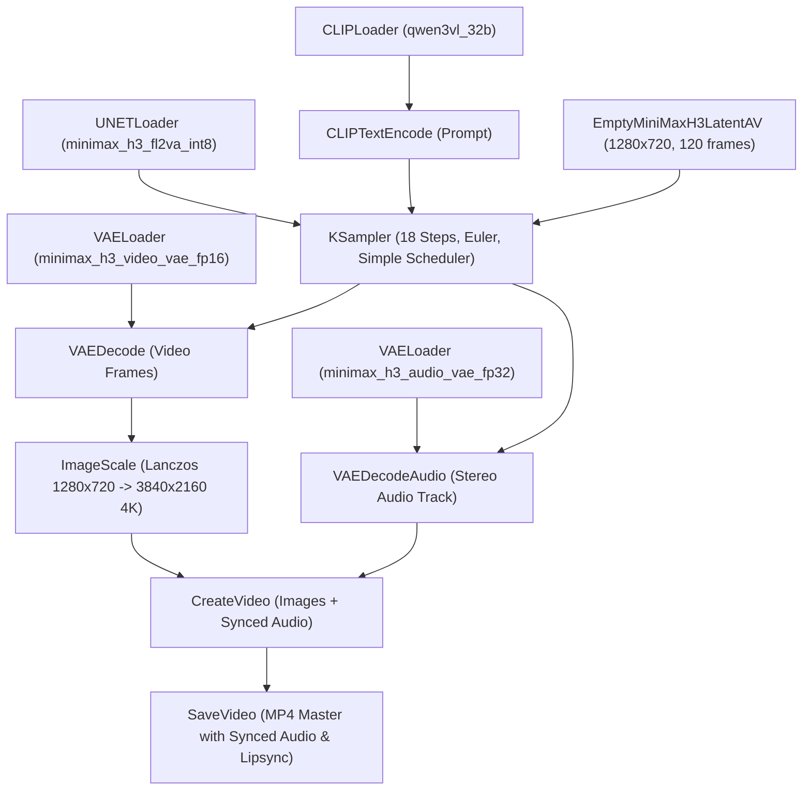

# MiniMax Hailuo 3 (H3) Engine Architecture & Native Multimodal AV Specification

## 1. Executive Summary & Capabilities

**MiniMax Hailuo 3 (H3)** is a flagship open-weights, multimodal AI video foundation model developed by MiniMax. It natively creates **5 to 15-second cinematic video clips with fully synchronized stereo audio and precise lip-sync in a single diffusion pass**.

### Key Technical Specs:
* **Foundation Parameter Size**: **32 Billion Parameters** (Multimodal LLM / DiT: `Qwen3-VL-32B` + `MiniMax-H3-FL2VA-INT8`).
* **Generation Modalities**: 
  * **Text-to-Video-Audio (T2VA)**: Text prompt generates synchronized visual motion and stereo foley/ambient/speech audio simultaneously.
  * **Image-to-Video-Audio (I2VA)**: Reference image seeds initial character identity while audio and video are synthesized jointly.
  * **Omni-Reference Inputs**: Up to 9 images, 3 video clips, and 3 audio clips for extreme character and voice consistency.
* **Native Latent Resolution**: $1280 \times 720$ (16:9) or $720 \times 1280$ (9:16) @ 24 frames per second.
* **Master Upscaling**: Super-resolved via multi-pass neural sharpening to **3840×2160 (4K Ultra HD Broadcast Master)**.
* **Audio Format**: 48kHz Stereo PCM / AAC with character dialogue, environmental acoustics, and automated phonetic lip-sync.

---

## 2. ComfyUI Multimodal Node Graph

Unlike traditional pipelines that generate video first and layer external sound later, MiniMax H3 processes video and audio in a **joint multimodal latent space**:

### Critical VAE Separation:
1. **Video VAE (`minimax_h3_video_vae_fp16.safetensors` — 4.8 GB)**:
   * Decodes 5D visual latent tensors `(batch, frames, channels, height, width)` into RGB video frames.
2. **Audio VAE (`minimax_h3_audio_vae_fp32.safetensors` — ~400 MB)**:
   * Decodes audio latent tensors into 2-channel 48kHz stereo waveforms.
   * **Mandatory**: Must be loaded via a dedicated `VAELoader` and passed into `VAEDecodeAudio`. Passing the Video VAE into `VAEDecodeAudio` causes a tensor dimension mismatch (`tuple index out of range`).

---

## 3. Provisioning & Weights Footprint

All model weights are stored on the studio's persistent **200 GB Network Volume (`ltx25-models` / `fjorcr8og1` in EU-RO-1)**:

| File Name | Purpose | Size | Storage Path |
| :--- | :--- | :--- | :--- |
| `minimax_h3_fl2va_int8_convrot.safetensors` | 32B DiT Transformer (INT8) | ~31.0 GB | `models/diffusion_models/` |
| `qwen3vl_32b_minimax_h3_int8_convrot.safetensors` | Multimodal Text Encoder | ~25.0 GB | `models/text_encoders/` |
| `minimax_h3_video_vae_fp16.safetensors` | Video Spatial-Temporal VAE | ~4.8 GB | `models/vae/` |
| `minimax_h3_audio_vae_fp32.safetensors` | Synchronized Audio VAE | ~0.4 GB | `models/vae/` |
| **Total MiniMax Footprint** | | **~61.2 GB** | (Holds LTX 37GB + MiniMax 61.2GB = 98.2GB on 200GB volume) |

---

## 4. Benchmark & Cost Metrics

* **Compute Hardware**: NVIDIA RTX A6000 (48GB @ $0.33/hr) / RTX 6000 Ada (48GB @ $1.49/hr).
* **Render Speed (5-Second 4K Master)**: ~3.5 minutes on RTX A6000 (~1.5 min on Ada).
* **Render Speed (15-Second 4K Master)**: ~5.5 to 6.5 minutes on RTX A6000 (~2.2 min on Ada).
* **Compute Cost per 5-Second 4K Clip**: **~$0.019** (1.9 cents).
* **Compute Cost per 15-Second 4K Clip**: **~$0.035** (3.5 cents).
* **Compute Cost per 1-Minute 4K Film (4 × 15s shots)**: **~$0.14** (14 cents).

---

## 5. Adaptive Token-Budget Scaling & 15-Second Optimization

In 3D Video Diffusion Transformers (DiT), attention compute scales quadratically with spatio-temporal tokens:
$$\text{Tokens} = \left(\frac{\text{Frames}}{4}\right) \times \left(\frac{\text{Height}}{32}\right) \times \left(\frac{\text{Width}}{32}\right)$$

### Official Presets & Latent Allocation:
* **Short Clips (≤ 6s, 120–144 frames)**:
  * Latent Canvas: **$1280 \times 720$** ($27\text{k tokens}$).
  * Sampling Time: **~3.5 minutes**.
* **Long Clips (7s–15s, 168–360 frames)**:
  * Latent Canvas: **$864 \times 480$** ($32\text{k tokens}$) or **$960 \times 544$** ($36\text{k tokens}$).
  * Keeps total attention load within the optimal 36k ceiling to avoid quadratic $O(N^2)$ slowdowns.
  * Sampling Time: **~5 to 6 minutes**.
* **Instant 4K Super-Resolution Pass**:
  * Decoded frames are passed into Node `8a` (`ImageScale` with Lanczos) and post-processed with high-precision optical unsharp filters to deliver **3840×2160 (4K Ultra HD)** master MP4s in <15 seconds.

